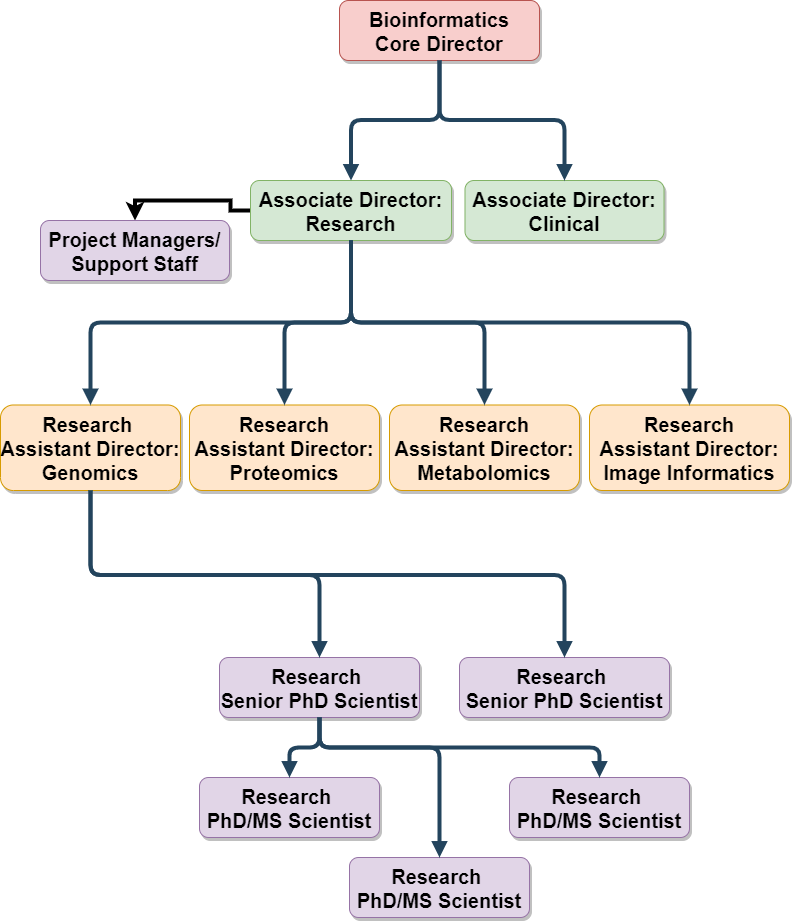

## Core Organizational Structure {.page_break_before}

Core organization shall follow basic principals of ICS. Staffing shall be filled from the top down as demand is generated for specific roles. All roles will maintain the responsibilities of lower branches until subsequent steps are implemented. For example: If no Research Assistant Director for Metabolomics is assigned, the Associate Director of Research will bear the responsibilities for Metabolomics. At any stage if >7 staff are reporting up a tier to a single staff member an additional tier must be implemented. As within emergency services, this design is inherently flexible for scaling up or down as needed. 

{#fig:wide-image}
Example for a full administration build out of organization

