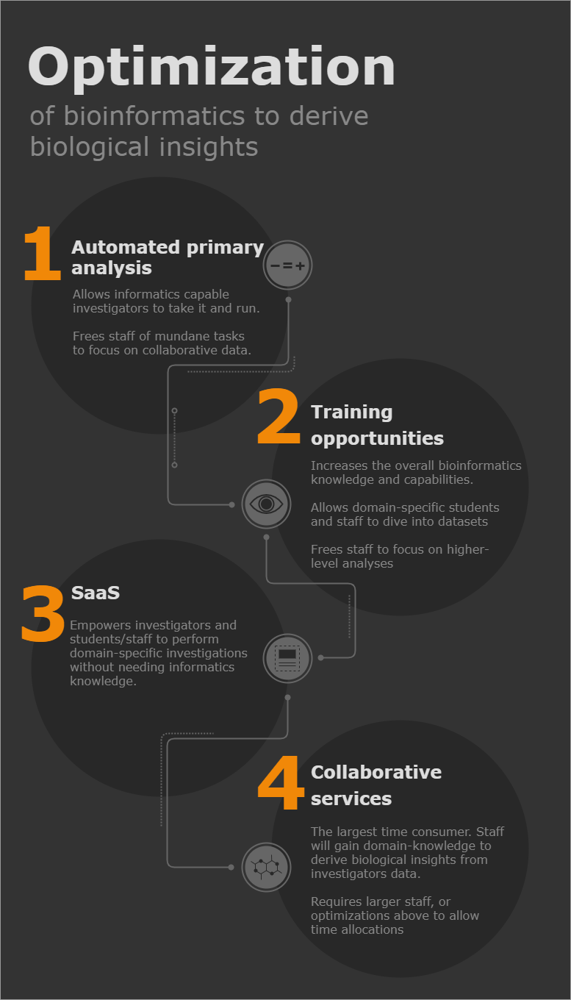

## Core Optimization {.page_break_before}

The 4 revenue streams mentioned above are structured to **enable biological insights from high throughput datasets**, and each provides separate optimizations to meet this end goal and are summarized in this image. 

{#fig:wide-image}

- Automation of primary analysis. These are traditionally very routine tasks that are near identical for every experiment. Once automated, this will drastically reduce time burdens on Core staff. The time savings for Core staff will allow them to partake in other ventures, such as developing further tools and working collaboratively with investigators. Additionally, by providing automated pipeline service to investigators and industry partners, this will be a very efficient revenue stream once established. 
- Training services. By raising the overall education level in bioinformatics through training, Core staff will be relied on less for mundane tasks, allowing their time to be spent on higher-level analyses. Additionally, the higher level of bioinformatics knowledge will allow for stronger collaborations and improved experimental design across the board. 
- SaaS. This will empower all investigators, students, and staff to be able to pull biological insights from their data without needing the informatics know-how. The Core staff will provide that know-how in the background by developing the SaaS tools to fit investigators needs. This will further alleviate time burdens on Core staff, allowing them to focus on developing custom tools for investigators or on collaborative data interrogations. 
- Collaborative services. By their very nature, these are the most time consuming. Bioinformaticians simply cannot be experts in every domain-specific field, but by having a base biological education they can lean on investigators domain-specific knowledge to pull insights from data sets. This must be **extremely collaborative**, the Core staff will provide the computational know-how and processing, the investigators will provide the domain-specific knowledge. As collaborations grow, and as the core grows to allow further specialization of staff, domain-specific knowledge will become more integrated into Core staff, enabling them to more effectively draw biological insights. 

[
The ultimate goal is a large semi-centralized Core team. Infrastructure will be provided from higher levels (OARC), and Core staff will specialize into technologically driven teams (genomics, proteomics, imaging, metabolomics etc). Teams will be able to lean on each other for computational support. Team members will be embedded across all campuses as needed, and as the team grows they will be able to specialize into domain-specific knowledge akin to a diffuse model.  
]{.banner .lightblue}