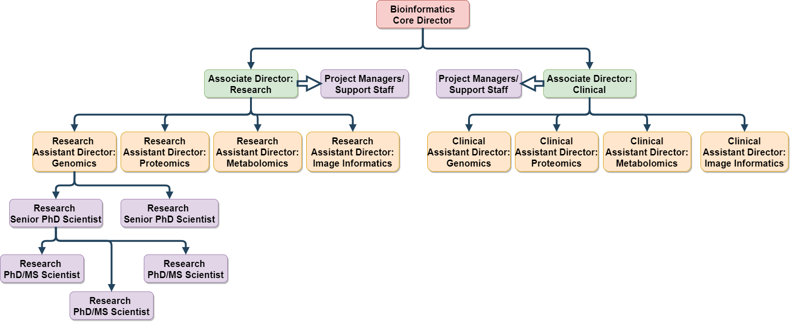
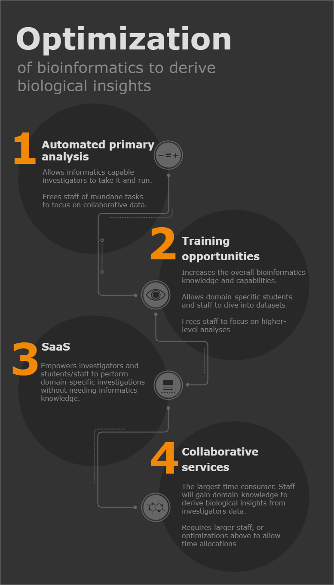

---
title: Bioinformatics Core Design Proposal
keywords:
- markdown
- publishing
- manubot
lang: en-US
date-meta: '2021-01-25'
author-meta:
- Alexander Lemenze
header-includes: |-
  <!--
  Manubot generated metadata rendered from header-includes-template.html.
  Suggest improvements at https://github.com/manubot/manubot/blob/main/manubot/process/header-includes-template.html
  -->
  <meta name="dc.format" content="text/html" />
  <meta name="dc.title" content="Bioinformatics Core Design Proposal" />
  <meta name="citation_title" content="Bioinformatics Core Design Proposal" />
  <meta property="og:title" content="Bioinformatics Core Design Proposal" />
  <meta property="twitter:title" content="Bioinformatics Core Design Proposal" />
  <meta name="dc.date" content="2021-01-25" />
  <meta name="citation_publication_date" content="2021-01-25" />
  <meta name="dc.language" content="en-US" />
  <meta name="citation_language" content="en-US" />
  <meta name="dc.relation.ispartof" content="Manubot" />
  <meta name="dc.publisher" content="Manubot" />
  <meta name="citation_journal_title" content="Manubot" />
  <meta name="citation_technical_report_institution" content="Manubot" />
  <meta name="citation_author" content="Alexander Lemenze" />
  <meta name="citation_author_institution" content="Department of Pathology, Immunology, and Laboratory Medicine, Rutgers University- New Jersey Medical School" />
  <meta name="citation_author_institution" content="Center for Immunity and Inflammation, Rutgers University- New Jersey Medical School" />
  <meta name="citation_author_orcid" content="0000-0003-3053-0849" />
  <link rel="canonical" href="https://alemenze.github.io/Core_Proposal/" />
  <meta property="og:url" content="https://alemenze.github.io/Core_Proposal/" />
  <meta property="twitter:url" content="https://alemenze.github.io/Core_Proposal/" />
  <meta name="citation_fulltext_html_url" content="https://alemenze.github.io/Core_Proposal/" />
  <meta name="citation_pdf_url" content="https://alemenze.github.io/Core_Proposal/manuscript.pdf" />
  <link rel="alternate" type="application/pdf" href="https://alemenze.github.io/Core_Proposal/manuscript.pdf" />
  <link rel="alternate" type="text/html" href="https://alemenze.github.io/Core_Proposal/v/120e99971f0fce0a50c1206b2fd464673d557d26/" />
  <meta name="manubot_html_url_versioned" content="https://alemenze.github.io/Core_Proposal/v/120e99971f0fce0a50c1206b2fd464673d557d26/" />
  <meta name="manubot_pdf_url_versioned" content="https://alemenze.github.io/Core_Proposal/v/120e99971f0fce0a50c1206b2fd464673d557d26/manuscript.pdf" />
  <meta property="og:type" content="article" />
  <meta property="twitter:card" content="summary_large_image" />
  <link rel="icon" type="image/png" sizes="192x192" href="https://manubot.org/favicon-192x192.png" />
  <link rel="mask-icon" href="https://manubot.org/safari-pinned-tab.svg" color="#ad1457" />
  <meta name="theme-color" content="#ad1457" />
  <!-- end Manubot generated metadata -->
bibliography:
- content/manual-references.json
manubot-output-bibliography: output/references.json
manubot-output-citekeys: output/citations.tsv
manubot-requests-cache-path: ci/cache/requests-cache
manubot-clear-requests-cache: false
...

<small><em>
This manuscript
([permalink](https://alemenze.github.io/Core_Proposal/v/120e99971f0fce0a50c1206b2fd464673d557d26/))
was automatically generated
from [alemenze/Core_Proposal@120e999](https://github.com/alemenze/Core_Proposal/tree/120e99971f0fce0a50c1206b2fd464673d557d26)
on January 25, 2021.
</em></small>

## Authors

+ **Alexander Lemenze** 
    {.inline_icon}
    [0000-0003-3053-0849](https://orcid.org/0000-0003-3053-0849)
    · {.inline_icon}
    [alemenze](https://github.com/alemenze) 
  <small>
     Department of Pathology, Immunology, and Laboratory Medicine, Rutgers University- New Jersey Medical School; Center for Immunity and Inflammation, Rutgers University- New Jersey Medical School
  </small>

## Bioinformatics Core facility need {.page_break_before}

### What is Bioinformatics
“A hybrid science that links biological data with techniques for information storage, distribution, and analysis to support multiple areas of scientific research, including biomedicine. Bioinformatics is fed by high-throughput data-generating experiments, including genomic sequence determinations and measurements of gene expression patterns. Database projects curate and annotate the data and then distribute it via the World Wide Web.” – Encyclopedia Britannica

### Need for a Core Facility
Data generation in biomedical and life science research is exponentially increasing in volume and scale. This requires a strong support network to facilitate the acquisition, management, analysis, visualization, and sharing of data. A Core facility can offer a shared resource to provide bioinformatics expertise, reduce overall hardware and personnel costs, and minimize duplication events. 

### Overview of Core Facility Design

Core facilities have been implemented with a variety of designs depending upon their physical needs and the particular establishment. A multitude of models have been used for designing bioinformatics core facilites. Often these end up swinging towards the poles of "biology" or "informatics" that must come together for an effective implementation. A few implementations are described below, followed by the proposed implementation.

1. Diffuse model

A diffuse bioinformatics model is what often occurs without a semi-centralized or centralized effort. This avenue entails individual laboratories hiring and maintaining bioinformatics staff/equipment. As each laboratory is responsible for the staff, they are intimately familiar with the associated biology. This intimate association with the biology constrains the diffuse bioinformaticians to work in an isolated environment and operate with full expertise of the project. Inherent in this model is increased costs for bioinformatics across the university, as individual laboratories each have increased staffing, and each will purchase and maintain their own informatics tools- such as local servers, HPC units, and software licenses. Additionally, as these bioinformaticians are focused on the biological questions at hand, they more often are entrenched in a canonical academic career path within that domain-specific field, not within a bioinformatics service effort or assisting on projects outside of their specialty. 

2. Pure Centralized model

A purely centralized model would be designed to build a pillar of bioinformatics at a central site. Though this can potentially be very strong, it also requires the largest buy in- both financial and investigator usage. As this type of model is often integral in developing infrastructure to facilitate high throughput data, this model can skew towards the informatics aspects. Inherent in this model is a lower overall cost of bioinformatics across the university, as the centralized core can leverage economy of scale for purchasing power for informatics tools. On the flip side, this model is often the least biologically focused, and can create a divide between the biologists and informaticians instead of uniting as bioinformaticians. 

3. Semi-Centralized model **(Proposed model)**

The Core facility proposed herein shall be a semi-centralized effort. A semi-centralized design incorporates the strengths of both previous models by integrating into an overarching centralized infrastructure and providing branches of staff into semi-specialized workflows. One major downside to this model is requiring a centralized infrastructure team, which fortunately in this instance is already in place with the [Office of Advanced Research Computing](https://oarc.rutgers.edu/). By nesting the bioinformatics core within the existing infrastructure, the semi-centralized model gains the benefits of lower operating costs and existing informatics knowledge. The bioinformatics team can then focus on tuning the informatics to fit biological questions. With this, the bioinformatics team will have the availability to branch into data-acquisition specialities (such as genomics/proteomics etc described below), to then build a strongly collaborative environment with domain-specific investigators. Long term, having the individual staff members as part of a specific technology team within the bioinformatics core will enable shared expertise to be aligned for developing multi-omics integration tools. 

## Bioinformatics Core Mission {.page_break_before}

[
TLDR: To continually evaluate best-in-class bioinformatics solutions, implement bleeding-edge bioinformatics techniques, and offer training of basic bioinformatics methods to advance reproducible analysis of biological data. 
]{.banner .lightblue}

Core facilities serve as a source of expertise in a particular field/topic to be shared amongst investigators. In the case of bioinformatics, the core facility is to provide expertise in computational analysis of biological datasets encompassing the fields of genomics, proteomics, metabolomics, and imaging based datasets. This includes operational know-how for computational tools, balancing hardware requirements for computational tools, benchmarking comparative computational tools, understanding the data generation techniques, and executing analyses. By leveraging the Core's expertise with these topics, investigators will be enabled to generate biologically driven discoveries. 

## Example Bioinformatics Cores {.page_break_before}

Various core facilities for bioinformatics have utilized their own solutions for implementation.

### List of examples:

- [The Applied Bioinformatics Laboratories at NYU](https://med.nyu.edu/research/scientific-cores-shared-resources/applied-bioinformatics-laboratories). This core facility offers services in a variation of the semi-centralized model. Staff are provided on a percent effort basis, scaling in 20% increments to essentially "rent" out the staff member to the respective lab for 1 day per 20% incremement per week [@https://med.nyu.edu/research/scientific-cores-shared-resources/applied-bioinformatics-laboratories].
- [The Harvard Chan Bioinformatics Core](https://bioinformatics.sph.harvard.edu/). This core facility offers standard services, but is renowned for their training capabilities [@https://bioinformatics.sph.harvard.edu/].
- [The UCSD Bioinformatics Core](http://compbio.ucsd.edu/services/). This core has multiple branches and generally runs on an hourly staff rate. In addition, they have an extension with a well known training program that funds many of their services [@https://extension.ucsd.edu/courses-and-programs/applied-bioinformatics].
- [The Bioinformatics Core at the University of Michigan](https://brcf.medicine.umich.edu/cores/bioinformatics-core/). This is a more traditional fee-for-service designed core facility, with basic pipeline services offered with additional add ons at cost. This core also has spawned at least one major bioinformatics company- [Advaita](https://advaitabio.com/) [@https://brcf.medicine.umich.edu/cores/bioinformatics-core/;@https://advaitabio.com/].
- [The University of Maryland Bioinformatics Core](http://biology.umd.edu/services.html). This core is a classic core facility offering hourly and per-project rates for pipelined services [@http://biology.umd.edu/services.html].
- [UT Southwestern Bioinformatics Core](https://www.utsouthwestern.edu/labs/bioinformatics/). This core has a slightly different spin on services, offering their staff as "on-demand" for FTE coverage, or as "in-residence" with salary coverage for a full year [@https://www.utsouthwestern.edu/labs/bioinformatics/].
- [The BSR at VIGR at UVM](https://www.med.uvm.edu/vigr/bioinformatics). Another slightly different take on a core, the Bioinformatics Shared Resource is nested within the Vermont Integrated Genomics Resource at UVM. This core charges an hourly rate to cover staff time operating on genomics workflows [@https://www.med.uvm.edu/vigr/bioinformatics].
- [Genomics and Informatics Core at MIT](https://cehs.mit.edu/core-facilities/genomics-and-informatics-facilities-core). This core also provides staff on an hourly rate to investigators, though they provide different costings for those who have invested in the core facility or provide staff [@https://cehs.mit.edu/core-facilities/genomics-and-informatics-facilities-core].

## Core Organizational Structure {.page_break_before}

Core organization shall follow basic principals of ICS. Staffing shall be filled from the top down as demand is generated for specific roles. All roles will maintain the responsibilities of lower branches until subsequent steps are implemented. For example: If no Research Assistant Director for Metabolomics is assigned, the Associate Director of Research will bear the responsibilities for Metabolomics. At any stage if >7 staff are reporting up a tier to a single staff member an additional tier must be implemented. As within emergency services, this design is inherently flexible for scaling up or down as needed. 

{#fig:wide-image}
Example for a full administration build out of organization

## Core Revenue Streams {.page_break_before}

This Core will focus on 4 primary revenue streams to both cover operational costs and provide for growth of the Core. These four revenue streams are designed to operate in synergy to meet the mission of the core. 

All project consultation will be provided free of any charge. 

### Fee per operation Services

Fee per operation services will be primarily prescribed functions and automated for maximum efficiency. These will involve upfront time investment, but long term will provide staff availability to focus on collaborative services focused on biological interpretation. 

#### Primary Data Analysis

The first facet of fee per operation would be primary data analysis. Many raw data outputs are natively human-unreadable. The primary data analysis will at minimum convert machine raw data to common data formats and/or human readable data structures. This will become a standard add-on to all data generating facilities services, and will be priced as an absolute minimum- covering purely the computational costs associated with the processing. These will be designed for standardizing output of data for other pre-defined pipelines, ease of staff use for collaborative usage, and input to SaaS tools. 

Example: Transcriptome analysis
- bcl to FASTQ conversion and demultiplexing to individual samples for NGS approaches
- Transcriptome alignment from FASTQ to bam files
- Differential gene expression analysis to human readable CSV (excel) files. 

#### Pre-defined Pipelines

The second facet to fee per operation would be some automated secondary data analysis. This is comparable to many contract research organization (CRO) offerings for analysis. All outputs will be explicitely pre-defined. 

Example: Transcriptome analysis + visualizations
- bcl to FASTQ conversion and demultiplexing to individual samples for NGS approaches
- Transcriptome alignment from FASTQ to bam files
- Differential gene expression analysis to human readable CSV (excel) files. 
- Principal component analysis and global hierarchal clustering
- Per-comparison volcano plots
- Heatmaps for top differentially expressed genes
- Basic Pathway analysis

### Training Services

Training services will be offered to increase the bioinformatics education level of university members. In alignment with traditional open-source values, **all** training materials will be made open-access. Charges will only be incurred for staffed courses. 

#### Prescribed courses

Prescribed courses will be developed for standard bioinformatics education. These will involve an initial time investment, but once developed will require minimal maintenance to stay up-to-date. Additionally, these courses can be made in-person, virtual, or interactive depending upon the topic involved. These will be offered at a regular interval, and potentially could grow in to a revenue stream of degree courses.

#### Spot courses

Spot courses will be offered at a higher rate than prescribed courses. These will be custom designed for investigators requests on bioinformatics techniques. For example, if a laboratory wishes to learn more about alignment algorithms but no prescribed course covers these topics, one will be developed and provided to the investigator's group.

### Software as a Service (SaaS)

Software as a Service is designed to enable investigators to perform biological analyses using informatically developed tools. There are an increasing number of companies exclusively designed around SaaS for bioinformatics, such as [Partek](https://www.partek.com/), [Basepair](https://www.basepairtech.com/), [Rosalind](https://www.onramp.bio/). This will be an in-house developed effort, designed both for customization and individualization of tools, as well as reduced costs compared to corporate efforts. The key is the core provides the bioinformatics expertise to manage the tools, the parent organization (IE OARC) can provide infrastructure, and the investigator provides their biological expertise. 

#### Access subscription

This will generate revenue in a subscription style. Individual investigator's labs, departments, or major centers can purchase subscriptions for their members. 

Examples:
- RNA-seq Shiny app. Investigators can take differentially expressed gene matrices (generated automatically in primary processing pipeline), and interogate their data at further depth with tools designed by bioinformaticians to enable their publication quality plot of data. 

### Collaborative Services

Collaborative services will be the primary time utilization of core personnel. With collaborative services core staff will directly interface with investigators, pairing the core staffs computation expertise with the investigators domain-specific knowledge. This collaboration should be proactively discussed to set expectations for the project. Core personnel will be often expected to learn portions of the domain-specific knowledge, but should **not** be expected to become domain-specific experts. That should remain the responsibility of the investigators, and is why this is a collaboration, not the diffuse bioinformatics model that requires domain-specific bioinformaticians. 

#### Grant percent Effort

As a collaborative service, grant percent effort is when Core staff are covered as primary personnel on sponsored research. The percentage of effort should be commesurate with the expenditure of time and higher-level analyses. For ease, this can be targeted at a scale of 20% increments- with each 20% corresponding to 1 day/week of the staff members time dedicated to that specific project. At minimum, it is highly recommended for bi-weekly meetings between the Core staff and investigator to ensure alignment of workflows and timely progress. 

#### Department/Unit support

Department/Unit support is designed to provide collaborative services to non-sponsored research. This often will encompass investigators side projects, development of tools/workflows for investigators usage, and most importantly preliminary data for grant applications. This should begin the integration of Core staff in to a project, ensuring appropriate data practices are being followed to strengthen the application as well as encourage applications. 

## Core Start up Logistics {.page_break_before}

To initiate the core facility there needs to be a cohesive and aggressive start up strategy, with associated buy-in from individual units. This implementation will expand on the models used for OARC's development of the [Amarel HPC system](https://oarc.rutgers.edu/resources/amarel/), as well as experiences from [MaGIC's](http://www.bioinformagic.io/) start up. To disburse costs of staff, core members will be initially embedded in individual campuses. This will enable a 50/50 split of staff costs, with staff focusing their efforts to the embedded campus- while maintaining their efforts to general core development (IE pipeline establishment/maintenance). Through this cost sharing, the initial core staff will consist of 7 members minimum in an ideal setting:

- OARC-Embedded Director
- Busch Staff
- Livingston Staff
- Cook/Douglas Staff
- College Ave Staff
- Camden Staff
- NJMS Newark Staff

#### Estimated Costs for start up staffing of ideal setting

Item | Unit cost | Units | Total costs
--- | --- | --- | ---
Staff salaries (minus benefits) | $100,000-$125,000 | 6 | $600,000-$750,000
Director salary (minus benefits) | $150,000-$200,000 | 1 | $150,000-$200,000
Staff workstations/laptops | $8,000 | 7 | $56,000
Amarel nodes for staff (3 nodes/staff) | $7,078 | 21 | $148,638
Amarel storage for staff (25tb/staff) | $150 | 175 | $26,250

##### Subtotal costs of ideal setting: 
$1,180,888
##### Subtotal after campus split of ideal setting:
$590,444

### Development timeline

1. Establish primary analysis pipelines. For the top seen workflows (IE: transcriptome analysis, whole genome sequencing, de novo assembly, 10X single cell etc), primary pipeline development would be first priority. This will enable initial revenue flow to the core, and should be heavily coordinated with data generating facilities. This should be operational for primary tools within **6 months** of inception. 
2. Initiate SaaS development. Baselines SaaS tools will additionally enable a continual revenue flow based on the subscription model, and will enable investigators to dive in to secondary analysis based on primary analysis outputs. This should be at least individidually operational for primary tools within **9 months** of inception. 
3. Expand/promote current training opportunities. Working in conjunction with current training courses and workshops, begin to expand the general bioinformatics know-how on campus while establishing entity. Collaborative trainings should be operational within **12 months**, with novel courses and workshops appearing within **24 months**. 
4. Foster collaborative analyses. Alongside other development efforts, staff should begin to foster deep biological assistance collaborations with investigators. This will enable investigators to glean insights from large dataset projects prior to completion of investigator-enabled analyses. This should be continual throughout the development of this core, but at inception should be **<50% of individual staff's time**. As the core grows and other revenue streams mature in development, it would be expected to approach **~80% of staff's time**. As these collaborations grow, it is expected staff will be increasingly covered by collaborators/departments grants and other funds, reducing central/school costs over time. 
5. Expand team. After 12 months of operations the core shall be evaluated for time demands, with the expectation of prompt expansion if justified. If within 12 months of operations the core is >50% covered through revenue streams and staff time are overtaxed, additional MS/PhD level staff will be pre-approved for rapid hire. 
6. Internal training/SOP development. To account for additional onboarding and potential turnover rates, internal trainings and SOP development will be one of the initial priorities of the core director. These shall be established within **12 months** of inception, and will also enable onboarding of non-primary staff more efficiently, such as collaborative post-docs/graduate students. 

#### Idea credit
Ideas for start up logistics synthesized from meeting with [Paul Copeland](https://molbiosci.rutgers.edu/faculty-research/faculty/faculty-detail/80-c-d/134-paul-r-copeland), [Nir Yakoby](https://yakoby.camden.rutgers.edu/members/nir-yakoby/), [Aaron Milstein](https://cabm.rutgers.edu/person/aaron-d-milstein), [Ron Hart](https://cbn.rutgers.edu/cb-profile/rhart), and [Premal Shah](https://molbiosci.rutgers.edu/faculty-research/faculty/faculty-detail/88-s-t/220-premal-shah)

## Core Optimization {.page_break_before}

The 4 revenue streams mentioned above are structured to **enable biological insights from high throughput datasets**, and each provides separate optimizations to meet this end goal and are summarized in this image. 

{#fig:wide-image}

- Automation of primary analysis. These are traditionally very routine tasks that are near identical for every experiment. Once automated, this will drastically reduce time burdens on Core staff. The time savings for Core staff will allow them to partake in other ventures, such as developing further tools and working collaboratively with investigators. Additionally, by providing automated pipeline service to investigators and industry partners, this will be a very efficient revenue stream once established. 
- Training services. By raising the overall education level in bioinformatics through training, Core staff will be relied on less for mundane tasks, allowing their time to be spent on higher-level analyses. Additionally, the higher level of bioinformatics knowledge will allow for stronger collaborations and improved experimental design across the board. 
- SaaS. This will empower all investigators, students, and staff to be able to pull biological insights from their data without needing the informatics know-how. The Core staff will provide that know-how in the background by developing the SaaS tools to fit investigators needs. This will further alleviate time burdens on Core staff, allowing them to focus on developing custom tools for investigators or on collaborative data interrogations. 
- Collaborative services. By their very nature, these are the most time consuming. Bioinformaticians simply cannot be experts in every domain-specific field, but by having a base biological education they can lean on investigators domain-specific knowledge to pull insights from data sets. This must be **extremely collaborative**, the Core staff will provide the computational know-how and processing, the investigators will provide the domain-specific knowledge. As collaborations grow, and as the core grows to allow further specialization of staff, domain-specific knowledge will become more integrated into Core staff, enabling them to more effectively draw biological insights. 

[
The ultimate goal is a large semi-centralized Core team. Infrastructure will be provided from higher levels (OARC), and Core staff will specialize into technologically driven teams (genomics, proteomics, imaging, metabolomics etc). Teams will be able to lean on each other for computational support. Team members will be embedded across all campuses as needed, and as the team grows they will be able to specialize into domain-specific knowledge akin to a diffuse model.  
]{.banner .lightblue}

## References {.page_break_before}

<!-- Explicitly insert bibliography here -->

